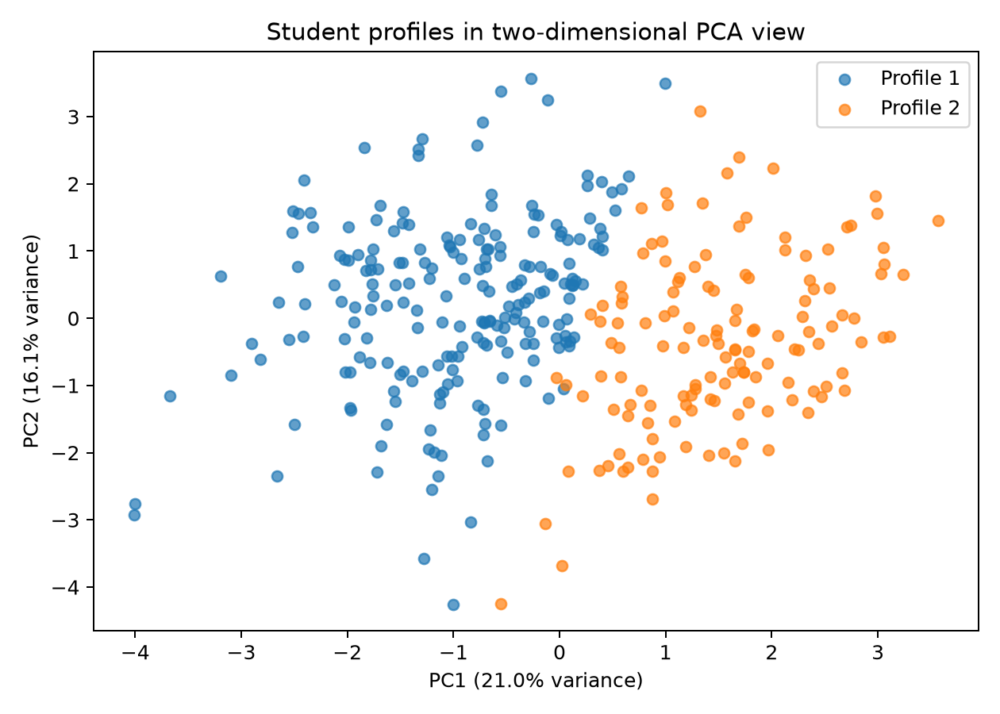

# Clustering Analysis

## Purpose and safeguards

This analysis discovers descriptive student profiles in the cleaned 351-response Bangladesh university survey. It is **not** a supervised dropout predictor. `Timestamp`, `dropout_intention_score`, all derived risk classes, and `academic_overwhelm` were excluded from clustering. The 1–5 dropout-intention response was used only after cluster assignment to describe the resulting groups.

## Preprocessing and feature selection

The exploratory run used the 20 admissible non-target survey factors. Nominal variables were one-hot encoded; ordered categories were explicitly ordinal-encoded and standardized; the 1–5 internet-quality rating was standardized. Based on interpretability, redundancy, and strength in distinguishing the exploratory clusters, the final profile model uses 12 variables:

`age_group`, `academic_level`, `personal_income`, `employment_type`, `internet_quality`, `living_arrangement`, `study_routine`, `family_income`, `scholarship`, `study_space_quality`, `academic_resource_access`, and `current_gpa`.

This reduction is for a concise profile explorer, not evidence that omitted factors are unimportant to student welfare.

## Number of clusters

Each candidate value of k was fitted with 10 fixed seeds and 20 K-Means initializations per seed.

| k | Silhouette, mean ± SD | Davies–Bouldin, mean ± SD | Mean pairwise ARI | Minimum ARI | Seed-42 sizes |
|---:|---:|---:|---:|---:|---:|
| 2 | 0.1338 ± 0.0002 | 2.2808 ± 0.0035 | 0.9894 | 0.9772 | 138, 213 |
| 3 | 0.1183 ± 0.0015 | 2.3508 ± 0.0104 | 0.9044 | 0.7899 | 99, 112, 140 |
| 4 | 0.1159 ± 0.0011 | 2.2770 ± 0.0142 | 0.8539 | 0.6477 | 51, 91, 101, 108 |
| 5 | 0.1003 ± 0.0018 | 2.2719 ± 0.0328 | 0.5509 | 0.3766 | 55, 72, 74, 75, 75 |

The selected solution is **k=2**. It has the best silhouette score, extremely high repeatability, and two adequately sized groups. Its final seed-42 silhouette is 0.1335 and Davies–Bouldin score is 2.2859. The low silhouette and substantial PCA overlap mean separation is weak: these are broad descriptive profiles, not natural or diagnostic student types.

PC1 and PC2 explain 21.0% and 16.1% of transformed variance (37.0% combined), so this plot is illustrative rather than a complete representation of cluster geometry.

## Profile definitions

### Profile 1 — Early-Stage, Mostly Non-Working Students

213 students (60.7%). The dominant categories are age 21–23 (71.8%), undergraduate Year 1 (50.7%), no personal income (44.6%), and no employment (44.6%). Common circumstances include living at home/hostels (59.2%), sporadic study (39.0%), family income BDT 20,000–50,000 (42.3%), no scholarship (52.6%), and GPA 3.1–3.5 (40.9%).

### Profile 2 — Advanced-Stage, Working Students

138 students (39.3%). The dominant categories are age 24+ (83.3%), master's study (71.0%), personal income above BDT 10,000 (42.0%), and tuition/coaching work (35.5%). Common circumstances include living at home/hostels (78.3%), studying only before exams (50.0%), family income BDT 20,000–50,000 (44.9%), no scholarship (66.7%), and GPA 3.1–3.5 (43.5%).

The strongest distinctions are age group (Cramér's V 0.833), academic level (0.760), personal income (0.445), employment (0.390), and internet quality (0.311). Names are neutral summaries of dominant attributes, not value judgments.

## Post-hoc dropout-risk interpretation

“Elevated risk” means a survey response of 4 or 5 on the 1–5 dropout-intention item. It was not supplied to K-Means.

| Profile | Mean intention | Median | Elevated count | Elevated percentage |
|---|---:|---:|---:|---:|
| Profile 1 | 2.55 | 3 | 44 / 213 | 20.7% |
| Profile 2 | 2.44 | 2 | 33 / 138 | 23.9% |

The association is negligible and not statistically significant: χ²(1)=0.346, p=0.557, Cramér's V=0.038. Therefore the profiles must not be marketed as low-risk/high-risk groups, and membership must not produce an individual dropout probability.

## Reproducibility and limitations

The fitted preprocessing-plus-K-Means pipeline uses random state 42 and is saved only because the solution is highly stable across seeds. It supports deterministic profile assignment for the same answers. Limitations include convenience-survey sampling, self-reported categories, cross-sectional data, weak cluster separation, a single intention item rather than observed withdrawal, and no external validation. Cluster IDs have no intrinsic order.
