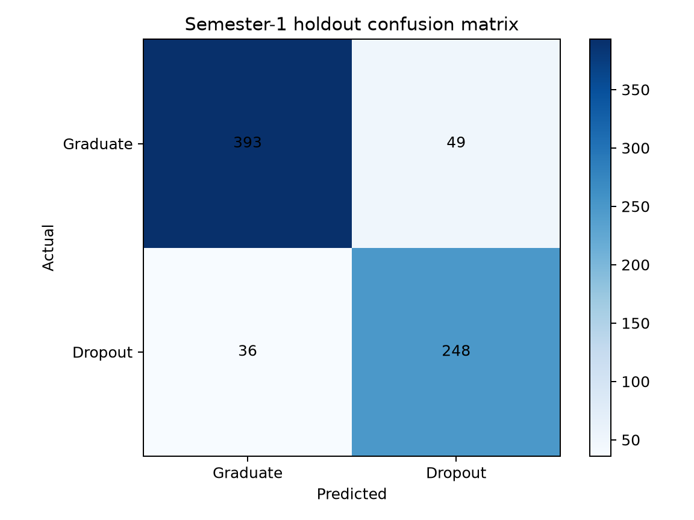
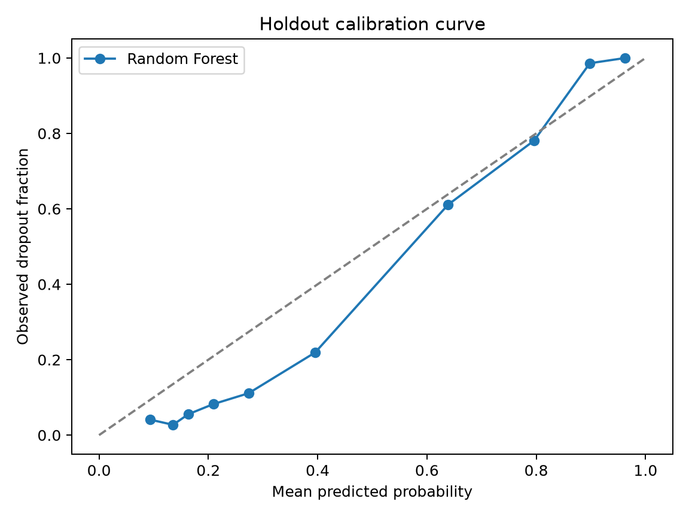

# Semester-1 Early-Warning Model Evaluation

## Cohort and prediction point

The official UCI file contains 4,424 students and 36 predictors: 2,209 Graduate, 1,421 Dropout, and 794 Enrolled. Enrolled records were excluded because their final outcome is unresolved. The binary cohort is therefore 3,630 students, with 1,421 dropouts (39.15%). The prediction point is the **end of Semester 1**.

The split was stratified and reproducible: 2,904 training records and a locked 726-record holdout (`random_state=42`). Feature selection, model comparison, and threshold selection used training data only.

## Leakage controls

`Target`, every `Curricular units 2nd sem` field, final outcomes, Application mode/order, Course, Nacionality, Unemployment rate, Inflation rate, and GDP were excluded. All retained fields are available by the end of Semester 1. No evidence of direct target or post-Semester-1 leakage remains.

## Repeated cross-validation

Results are means ± standard deviations from repeated stratified 5-fold CV (2 repeats) on the training partition, using the simplified form.

| Model | ROC-AUC | PR-AUC | Precision | Recall | F1 | Balanced accuracy |
|---|---:|---:|---:|---:|---:|---:|
| Logistic Regression | 0.9114 ± 0.0182 | 0.9031 ± 0.0204 | 0.8420 ± 0.0087 | 0.8109 ± 0.0183 | 0.8261 ± 0.0119 | 0.8565 ± 0.0099 |
| Random Forest | **0.9233 ± 0.0157** | 0.9192 ± 0.0155 | 0.8592 ± 0.0066 | 0.8237 ± 0.0274 | 0.8409 ± 0.0150 | 0.8684 ± 0.0128 |
| XGBoost | 0.9222 ± 0.0138 | **0.9214 ± 0.0124** | 0.8624 ± 0.0129 | 0.8215 ± 0.0203 | **0.8414 ± 0.0150** | **0.8686 ± 0.0123** |

Random Forest was selected under the predeclared priority because it had the highest mean ROC-AUC, essentially tied secondary metrics, and stable folds. There is no material evidence of unstable CV performance.

## Threshold

Out-of-fold training probabilities were evaluated from 0.20 through 0.70. The selected threshold is **0.48**. On training OOF predictions it achieved precision 0.856, recall 0.834, F1 0.845, and a 38.2% alert rate. The test set was not used to choose it.

## One-time holdout evaluation

| Metric | Result |
|---|---:|
| Accuracy | 0.8829 |
| Balanced accuracy | 0.8812 |
| Precision | 0.8350 |
| Recall | 0.8732 |
| F1 | 0.8537 |
| ROC-AUC | 0.9385 |
| PR-AUC / Average precision | 0.9300 |
| Brier score | 0.0967 |
| Predicted-positive rate | 40.91% |

Confusion matrix: TN=393, FP=49, FN=36, TP=248. The false-positive burden is meaningful but not excessive for a support-oriented screen, while 87.3% of resolved dropouts were flagged.

## Calibration

The Brier score is usable (0.0967), but the calibration curve shows some overprediction in lower-probability bins and local variation. Percentages may be presented as estimates with a prominent limitation, not as certainties. External calibration is required before operational use in another country.

## Generalization assessment

The holdout ROC-AUC is 0.015 above the repeated-CV mean and holdout F1 is 0.013 above it, rather than collapsing. This does not suggest harmful overfitting on this split. It also does not prove cross-country generalization: the source is one Portuguese higher-education setting.
